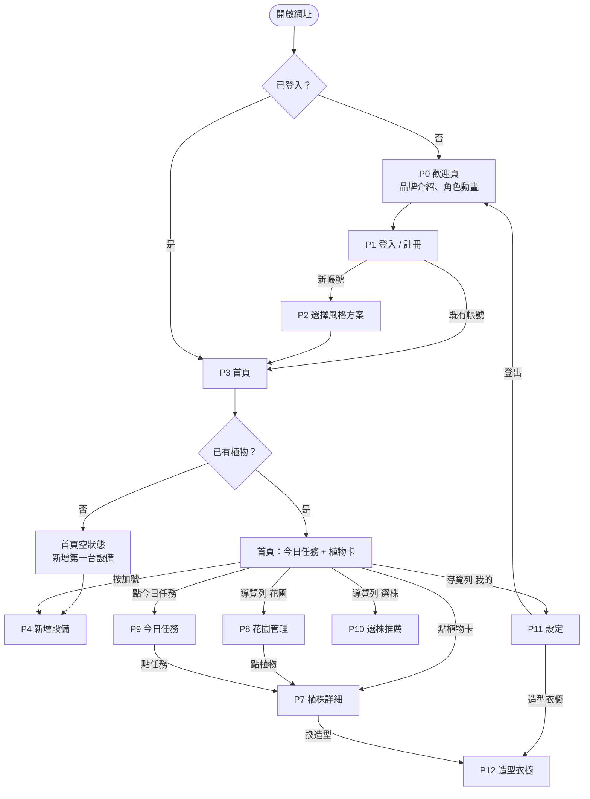
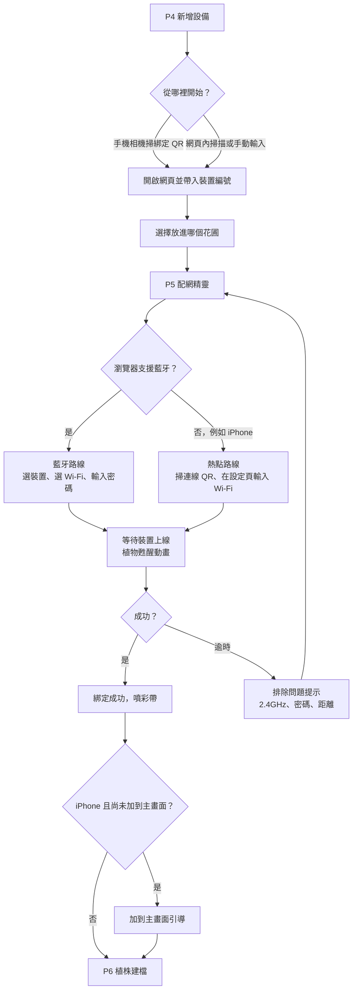
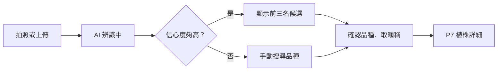
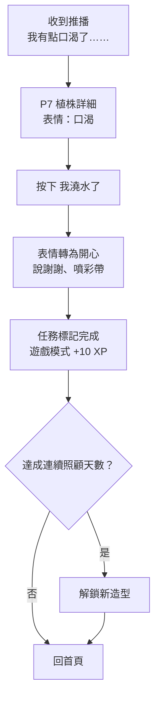
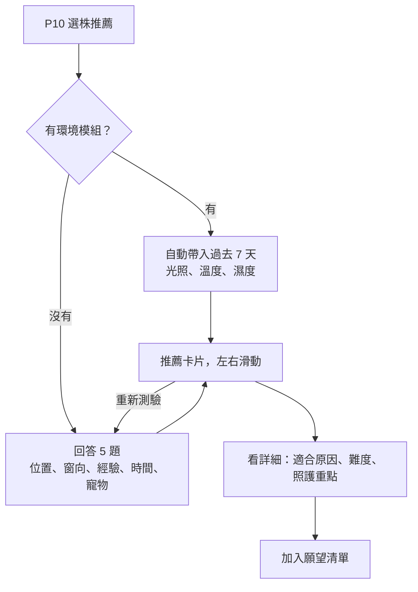

# GreenBuddy 展示版：使用流程與畫面規劃

> 版本：Demo v1（2026-09）
> 用途：初始提案報告的畫面展示，以及後續用 AI 逐步開發的規格依據。
> 相關文件：《GreenBuddy Server 架構》、《GreenBuddy App 架構》

---

## 0. 這個版本的定位

| 項目 | 展示版的做法 | 正式版（見 App 架構文件） |
|---|---|---|
| 技術 | 純 HTML + CSS + JS，外部套件用 CDN(內容傳遞網路) 載入 | Vue 3 + Vite + PWA |
| 資料 | 全部假資料，寫在 `mock-data.js` | 串接 FastAPI 後端 |
| 登入 | 任何帳密都能登入，狀態存在 `localStorage` | JWT token |
| 配網 | 流程畫面完整，連線結果用模擬 | 真的走藍牙 / 熱點 |
| 目標裝置 | 手機尺寸為主；電腦上顯示成置中的手機外框 | 響應式 |

**原則**：畫面和流程要跟正式版一致，只是背後的資料是假的。這樣展示版的畫面之後可以直接當作正式版的設計稿。

---

## 1. 整體風格方向

### 1.1 關鍵字

**溫暖、圓潤、療癒、會說話的植物。**

GreenBuddy 的差異化之一是「陪伴感」，所以整個介面的主角不是數字，而是**植物角色本身**：每一盆植物都有一張臉，表情就是它的狀態。使用者不需要看懂「土壤濕度 18%」，只要看到植物流汗、嘴巴乾乾的，就知道它渴了。數字仍然存在，但放在第二層。

### 1.2 植物角色（全站最重要的元件）

每盆植物用一個 SVG(向量圖) 角色呈現：陶土色花盆 + 依品種簡化的葉子造型 + 盆身上的臉。

| 狀態代號 | 情境 | 表情與效果 |
|---|---|---|
| `happy` | 一切正常 | 瞇眼微笑，葉子輕輕搖擺 |
| `thirsty` | 土壤太乾 | 嘴巴乾扁、頭上一滴汗，葉子微垂 |
| `overwater` | 土壤太濕 | 臉頰鼓鼓、身邊冒小泡泡 |
| `dark` | 光照不足 | 眼睛無神、頭上一朵小烏雲 |
| `hot` | 太熱或太曬 | 眼睛轉圈圈、臉紅 |
| `sleeping` | 夜間 | 閉眼，頭上 Zzz |
| `offline` | 感測器失聯 | 灰階、頭上問號 |

**品種造型（展示版先做 4 種）**：龜背芋（有裂口的大葉）、黃金葛（垂下的藤蔓）、虎尾蘭（直立長葉）、多肉（蓮座狀）。

**動畫**：待機時葉子左右擺動約 2 度、每 4 秒眨一次眼。全部用 CSS animation(樣式動畫) 做，不需要額外套件。

### 1.3 三套風格方案

風格分成**外觀**（配色、圓角、陰影）和**個性**（文案語氣、是否顯示經驗值）。展示版把兩者綁在一起，做成三套：

| 方案 | 代號 | 外觀 | 個性 |
|---|---|---|---|
| 陪伴（預設） | `companion` | 奶油底色、柔和陰影、大圓角 | 植物用第一人稱說話，溫柔 |
| 遊戲任務 | `game` | 明亮飽和、厚實陰影、徽章 | 任務、經驗值、等級、連續天數 |
| 簡潔 | `simple` | 淺灰綠、細線條、小圓角 | 直接給數字和建議，不閒聊 |

```css
:root[data-theme="companion"] {
  --bg: #FFF8EE;  --surface: #FFFFFF;  --text: #4A3F35;  --text-sub: #8C7B6B;
  --primary: #7CB86A;  --accent: #E8956B;  --water: #7EC4E6;
  --warn: #F2B544;  --danger: #E57373;
  --radius: 24px;  --shadow: 0 6px 20px rgba(122, 90, 60, .10);
}
:root[data-theme="game"] {
  --bg: #F4F6FF;  --surface: #FFFFFF;  --text: #2B2D42;  --text-sub: #6B6F85;
  --primary: #34C471;  --accent: #FFB02E;  --water: #4DA8F0;  --special: #7B6CF6;
  --warn: #FFB02E;  --danger: #F2545B;
  --radius: 16px;  --shadow: 0 4px 0 rgba(43, 45, 66, .12);
}
:root[data-theme="simple"] {
  --bg: #F6F8F7;  --surface: #FFFFFF;  --text: #22313F;  --text-sub: #6A7A86;
  --primary: #2E8B6E;  --accent: #3D6A8A;  --water: #3D8FB8;
  --warn: #D99A1E;  --danger: #C94C4C;
  --radius: 12px;  --shadow: 0 1px 3px rgba(0, 0, 0, .08);
}
```

切換方式：在 `<html>` 上改 `data-theme` 屬性，所有顏色自動跟著換。

### 1.4 字體與版面

- 中文字體：**jf open 粉圓**（開源圓體，下載 woff2 放進 `assets/fonts/`），備援 Noto Sans TC（Google Fonts）。簡潔模式可改用 Noto Sans TC。
- 內文 16px 起跳，標題 22～28px，數字用粗體放大。
- 設計尺寸以 390 × 844（常見手機）為準；電腦上把整個畫面放進置中的手機外框，方便展示和截圖。
- 狀態不只靠顏色表達，一定同時有表情或文字，照顧色弱使用者。

### 1.5 外部套件

| 套件 | 用在哪裡 | 必要性 |
|---|---|---|
| Chart.js | 植株歷史曲線 | 必要 |
| canvas-confetti | 完成任務、綁定成功時噴彩帶 | 必要（陪伴感的關鍵） |
| Phosphor Icons | 全站圖示，選 duotone(雙色) 風格較可愛 | 必要 |
| SweetAlert2 | 確認視窗、提示視窗，可自訂成圓潤風格 | 建議 |
| Swiper | 歡迎頁輪播、選株推薦卡片滑動 | 建議 |
| lottie-web | 載入中、辨識中、澆水水滴等過場動畫 | 可選 |
| html5-qrcode | 網頁內真的要掃 QR 時 | 可選（展示版用模擬掃描） |

全部透過 jsDelivr 或 cdnjs 載入，**網址裡要固定版本號**，避免哪天套件更新導致展示當天畫面壞掉。Lottie 動畫素材若取自 LottieFiles，要確認授權為免費可商用。

---

## 2. 全站導覽結構

登入後的主要頁面由**底部導覽列**串起來：

| 分頁 | 圖示 | 前往 |
|---|---|---|
| 首頁 | 房子 | P3 首頁 |
| 花圃 | 盆栽 | P8 花圃管理 |
| 任務 | 勾選清單 | P9 今日任務 |
| 選株 | 放大鏡葉子 | P10 選株推薦 |
| 我的 | 人像 | P11 設定 |

首頁右下角另有一顆浮動的「＋」按鈕，進入新增設備流程。

---

## 3. 使用流程圖

### 3.1 進入與主要導覽



### 3.2 新增設備與配網



### 3.3 植株建檔



### 3.4 日常照護循環（陪伴感的核心）



> 正式版中，表情要等感測器確認濕度回升才轉為開心；展示版按下按鈕就直接切換。

### 3.5 選株推薦



---

## 4. 畫面規劃

每頁依相同格式描述：**目的 → 風格與版面 → 操作與去向 → 使用者獲得的資訊 → 展示版備註**。

---

### P0 歡迎頁 `index.html`

**目的**：第一印象。讓人一眼知道這是「會說話的植物夥伴」，並導向登入。

**風格與版面**
- 滿版奶油色背景，畫面中央是一盆大大的植物角色（`happy`，搖葉 + 眨眼）。
- 角色下方用 Swiper 做三張輪播卡：「選株：幫你挑適合家裡的植物」、「養株：它渴了會告訴你」、「陪伴：每一盆都有自己的個性」。
- 最下方兩顆按鈕：主要按鈕「開始使用」、次要文字按鈕「我已經有帳號」。

**操作與去向**

| 操作 | 結果 |
|---|---|
| 左右滑輪播卡 | 看三個核心價值 |
| 開始使用 | P1，停在「註冊」分頁 |
| 我已經有帳號 | P1，停在「登入」分頁 |

**獲得的資訊**：產品能幫我做什麼。

**展示版備註**：已登入者直接跳 P3。

---

### P1 登入 / 註冊 `login.html`

**目的**：建立或進入帳號。

**風格與版面**
- 上方一盆小植物角色；**輸入密碼時，植物用葉子遮住眼睛**，離開密碼欄再放下。這是低成本但很有記憶點的小互動。
- 兩個分頁切換：登入（Email、密碼）／註冊（暱稱、Email、密碼）。
- 輸入框大圓角、聚焦時外框變主色。

**操作與去向**

| 操作 | 結果 |
|---|---|
| 登入 | P3 首頁 |
| 註冊 | P2 選擇風格方案 |
| 忘記密碼 | SweetAlert2 提示「重設信已寄出」（展示用） |

**獲得的資訊**：無，純入口。

**展示版備註**：任何帳密都通過；暱稱存進 `localStorage`，之後的問候語會用到。

---

### P2 選擇風格方案 `style-pick.html`

**目的**：新使用者第一次選擇「想要怎樣的植物夥伴」。這頁同時是提案裡展示「多風格方案」最直接的畫面。

**風格與版面**
- 標題：「你希望植物怎麼跟你說話？」
- 三張大卡片直向排列，每張包含：方案名稱、一句說明、**同一個情境（缺水）在這個方案下的說法**、該方案的配色小預覽。
- 點選任一張卡片，整頁配色立即切換成該方案，讓使用者「試穿」。

**操作與去向**

| 操作 | 結果 |
|---|---|
| 點選卡片 | 整頁即時換成該方案的外觀 |
| 就決定是你了 | 儲存選擇，前往 P3 |
| 之後再說 | 使用預設「陪伴」，前往 P3 |

**獲得的資訊**：三種方案的差異，以及之後可以在設定中更改。

---

### P3 首頁 `home.html`

**目的**：一眼知道「今天誰需要我」。這是使用頻率最高的頁面。

**風格與版面**（由上到下）
1. **問候列**：依時間顯示早安／午安／晚安 + 暱稱；右邊一個小植物頭像，旁邊對話泡泡顯示當日問候（依風格方案）。
2. **遊戲模式限定**：一條經驗值進度條、等級稱號（例如「Lv.3 綠手指學徒」）、連續照顧天數的火焰圖示。
3. **花圃切換**：橫向膠囊按鈕「全部 / 客廳 / 陽台」。
4. **今日任務卡**：最多顯示 3 項，每項左邊是植物小頭像、右邊是一句任務文字與「完成」按鈕；右上「看全部」。
5. **植物卡片牆**：兩欄格狀，每張卡片是植物角色（帶表情）、暱稱、品種、一句狀態、底部一條土壤濕度小橫條。需要照顧的卡片排在前面，並有輕微的彈跳提示。
6. 右下角浮動「＋」按鈕。

**簡潔模式**：植物卡片改為單欄清單，左邊小圖示、右邊直接列出四項數值。

**空狀態**：沒有植物時，中央顯示一個空花盆插圖和「還沒有植物夥伴，一起迎接第一盆吧」，下方大按鈕「新增設備」。

**操作與去向**

| 操作 | 結果 |
|---|---|
| 點植物卡 | P7 植株詳細 |
| 任務的「完成」 | 原地打勾、噴彩帶，任務淡出 |
| 看全部任務 | P9 |
| 切換花圃膠囊 | 卡片牆只顯示該花圃的植物 |
| ＋ | P4 新增設備 |

**獲得的資訊**：哪幾盆需要照顧、今天要做哪些事、各花圃整體狀況。

---

### P4 新增設備 `add-device.html`

**目的**：把一台新的 GreenBuddy 綁到自己的帳號和花圃。

**風格與版面**
- 最上方三段式步驟條：① 綁定 → ② 連上網路 → ③ 植物建檔。三頁（P4、P5、P6）共用。
- 一張裝置插圖，用箭頭標出 QR 貼紙的位置。
- 主要按鈕「掃描裝置上的 QR」；次要文字連結「手動輸入裝置編號」。
- 掃描成功後顯示裝置卡：「找到 GB-000123」+ 下拉選單「放在哪個花圃？」（含「＋ 新增花圃」）。

**操作與去向**

| 操作 | 結果 |
|---|---|
| 掃描 QR | 顯示裝置卡 |
| 手動輸入 | 顯示輸入框，送出後顯示裝置卡 |
| 選擇花圃，按下一步 | P5 配網精靈 |

**獲得的資訊**：裝置是否有效、要放在哪裡。

**展示版備註**：「掃描」按鈕直接模擬成功，回傳 `GB-000123`。也支援網址參數 `add-device.html?d=GB-000123`，模擬用手機相機掃 QR 的情境。

---

### P5 配網精靈 `provision.html`

**目的**：讓裝置連上家裡的 Wi-Fi。這是 IoT 產品最容易讓人放棄的一步，所以畫面要讓人**安心、清楚、不怕出錯**。

**風格與版面**
- 頁面一開始先偵測瀏覽器，顯示一句：「我們會用藍牙連線」或「iPhone 請跟著下面 4 個步驟」。
- **藍牙路線**：大按鈕「連接 GreenBuddy」→ 提示「瀏覽器會跳出選擇視窗，請選 GreenBuddy-XXXX」→ Wi-Fi 清單（訊號強度圖示）→ 密碼輸入 → 送出。
- **熱點路線**：四張圖解步驟卡，依序是「長按裝置按鈕 3 秒，燈開始呼吸」「用相機掃背面的連線 QR」「在跳出的設定頁選 Wi-Fi、輸入密碼」「看到成功後回到這裡」。
- **等待畫面**：植物角色從 `sleeping` 慢慢睜眼，搭配文字「正在叫醒你的植物……」，下方輪播小知識（例如「GreenBuddy 只支援 2.4GHz Wi-Fi」）。
- **成功**：彩帶 + 植物說「嗨！我醒來了」+ 按鈕「幫它建立檔案」。
- **失敗**：植物 `offline` 表情 + 排除清單（確認是 2.4GHz、密碼大小寫、裝置距離路由器 3 公尺內）+「再試一次」。

**操作與去向**

| 操作 | 結果 |
|---|---|
| 完成藍牙或熱點步驟 | 進入等待畫面 |
| 成功後「幫它建立檔案」 | iPhone 且未安裝：先顯示「加到主畫面」引導；其餘直接到 P6 |
| 失敗後「再試一次」 | 回到本頁開頭 |

**獲得的資訊**：目前進行到哪一步、失敗時該檢查什麼。

**展示版備註**：展示控制面板可以強制切換路線、指定成功或失敗，方便現場示範兩種情境。

---

### P6 植株建檔 `plant-new.html`

**目的**：告訴系統這盆是什麼植物，照護建議才會準。

**風格與版面**
- 圓角取景框 + 大按鈕「拍一張照片」（用 `<input type="file" accept="image/*" capture="environment">`，手機會直接開相機）。
- 辨識中：放大鏡在葉子上移動的動畫，文字「正在認識它……」。
- 辨識結果：前三名候選卡，每張有品種名、參考小圖、信心度橫條。
- 確認後：暱稱輸入框，旁邊一顆骰子按鈕「幫我取名」（隨機給「小綠、波波、阿福、白白、圓圓」等）。

**操作與去向**

| 操作 | 結果 |
|---|---|
| 拍照或上傳 | 進入辨識中 |
| 點選候選品種 | 選中並進入取名 |
| 都不對 | 顯示品種搜尋框 |
| 完成 | 噴彩帶，前往 P7 |

**獲得的資訊**：這是什麼植物、AI 有多確定。

**展示版備註**：辨識固定回傳「龜背芋 92%、蔓綠絨 5%、合果芋 3%」，辨識動畫固定跑 2 秒。

---

### P7 植株詳細 `plant.html?id=p1`

**目的**：這盆植物的完整狀態、原因和該做的事。**這是整個產品最核心的頁面**，也是提案截圖的首選。

**風格與版面**（由上到下）
1. **角色區**：大尺寸植物角色（依狀態顯示表情與動畫）+ 對話泡泡（依風格方案的文案）；下方暱稱、品種、「我們認識 32 天了」。
2. **四個數值膠囊**：土壤濕度、光照、溫度、濕度。每個膠囊顯示目前數值、一條橫向刻度（理想範圍用淡主色標示、目前位置用圓點標示）、一個狀態字「剛好 / 偏乾 / 偏暗……」。
3. **歷史曲線**：Chart.js 線圖，上方分頁「24 小時 / 7 天 / 30 天」，可切換指標；理想範圍用淡綠色背景帶標示。線條要平滑（`tension: 0.4`）、點隱藏，比較柔和。
4. **照護建議三層**：三張可展開卡片，「現在該做」「這週注意」「長期照護」。
5. **動作按鈕**：主要按鈕「我澆水了」；次要按鈕「立即量測」、「換造型」。
6. **設備資訊**（摺疊區）：電量、訊號強度、最後回報時間、韌體版本。

**操作與去向**

| 操作 | 結果 |
|---|---|
| 我澆水了 | 植物轉為 `happy`、說謝謝、噴彩帶；遊戲模式顯示 +10 XP |
| 立即量測 | 提示「會在裝置下次醒來時量測（約 15 分鐘內）」 |
| 切換曲線分頁 | 圖表換時間範圍 |
| 展開建議卡 | 看詳細建議 |
| 換造型 | P12 |

**獲得的資訊**：植物現在好不好、為什麼、接下來該做什麼、過去的變化趨勢、感測器是否正常。

**展示版備註**：歷史曲線用程式產生（正弦波 + 隨機雜訊，澆水後濕度跳升再慢慢下降），看起來才像真的資料。

---

### P8 花圃管理 `gardens.html`

**目的**：以「空間」為單位管理植物，並和家人一起照顧。

**風格與版面**
- 每個花圃一張大卡片：名稱（客廳、陽台）、類型標籤（室內 / 陽台）、植物小頭像橫向排列。
- 有環境模組的花圃，卡片上多一列環境數值（溫度、濕度、光照）和一個小圖示「環境模組」。
- 卡片底部：成員頭像列 + 「邀請家人」按鈕。
- 頁面最下方「＋ 新增花圃」。

**操作與去向**

| 操作 | 結果 |
|---|---|
| 點植物小頭像 | P7 |
| 邀請家人 | SweetAlert2 顯示邀請連結與「複製」按鈕 |
| 新增花圃 | 彈窗輸入名稱與類型 |
| 點花圃卡片 | 展開該花圃的完整植物清單與環境曲線 |

**獲得的資訊**：各空間的環境狀況、每個空間有哪些植物、誰一起照顧。

---

### P9 今日任務 `tasks.html`

**目的**：所有待辦照護事項集中在這裡，並讓「完成」變成一件有成就感的事。

**風格與版面**
- 三個區塊：「今天」「稍後」「已完成」。
- 任務卡：左邊植物頭像（帶當下表情）、中間任務文字（依風格方案）、右邊「完成」與「略過」。
- **遊戲模式**：頁面頂部顯示今日可得的總經驗值；每張卡片右上有「+10 XP」徽章；完成時經驗條跳動。
- **陪伴模式**：完成後植物頭像換成開心表情，卡片上浮現一句感謝，再淡出到「已完成」。
- 全部完成時：整頁中央出現植物們一起跳舞的插圖 +「今天辛苦了」。

**操作與去向**

| 操作 | 結果 |
|---|---|
| 完成 | 彩帶、移到已完成 |
| 略過 | 詢問原因（剛澆過 / 下雨了 / 其他），移到已完成並標灰 |
| 點任務文字 | P7 該植株 |

**獲得的資訊**：今天要做什麼、完成了多少。

---

### P10 選株推薦 `select.html`

**目的**：在**買植物之前**，幫使用者找到適合自己環境的植物。這是 GreenBuddy 和多數競品不同的地方，因為它涵蓋了購買前的階段。

**風格與版面**
- **問卷模式**（沒有環境模組）：一題一頁，大圖示選項按鈕，上方進度點。五題：
  1. 想放在哪裡？（客廳 / 臥室 / 陽台 / 辦公室）
  2. 最近的窗戶朝哪邊？（東 / 南 / 西 / 北 / 沒有窗）
  3. 你的養植物經驗？（新手 / 養過幾盆 / 很有經驗）
  4. 一週能照顧幾次？（1 次 / 2～3 次 / 幾乎每天）
  5. 家裡有貓狗嗎？（有 / 沒有）
- **自動模式**（有環境模組）：直接顯示「根據陽台過去 7 天：平均光照 18,000 lux、溫度 24～33°C、濕度 62%」，下面接推薦結果。
- **推薦結果**：Swiper 卡片左右滑動，每張卡片包含植物插圖、名稱、適合度百分比（圓環圖）、三個「為什麼適合你」、照顧難度（葉子圖示 1～3 片）、寵物友善標籤。

**操作與去向**

| 操作 | 結果 |
|---|---|
| 回答問題 | 下一題，答完顯示結果 |
| 滑動卡片 | 看其他推薦 |
| 看詳細 | 展開照護重點與常見問題 |
| 加入願望清單 | 愛心動畫，存進清單 |
| 重新測驗 | 回到第一題 |

**獲得的資訊**：哪些植物適合我的環境和生活方式，以及原因。

**展示版備註**：推薦結果寫死在假資料中，依「窗向 + 經驗」兩個答案挑選不同組合即可。

---

### P11 設定（我的）`settings.html`

**目的**：個人化設定，以及現場展示「切換風格方案」的地方。

**風格與版面**
- **個人卡**：頭像、暱稱；遊戲模式顯示等級與徽章數，陪伴模式顯示「和植物們一起生活了 32 天」。
- **風格方案**：三個選項 + 下方一個即時預覽框，顯示「缺水」這件事在目前方案下的說法。切換時整頁即時換色。
- **通知**：開關、提醒時段；iPhone 使用者顯示「加到主畫面才收得到提醒」的教學入口；另有一顆「傳送測試通知」。
- **設備管理**：所有設備列表（電量、上線狀態），可解除綁定。
- **造型衣櫥**入口。
- **登出**。

**操作與去向**

| 操作 | 結果 |
|---|---|
| 切換風格方案 | 整站即時換外觀與文案 |
| 傳送測試通知 | 畫面頂部滑下一條模擬推播橫幅 |
| 造型衣櫥 | P12 |
| 登出 | 清除登入狀態，回 P0 |

**獲得的資訊**：目前設定、設備健康狀況。

---

### P12 造型衣櫥 `closet.html`

**目的**：讓持續照顧有收集的樂趣，增加黏著度。

**風格與版面**
- 上半部：目前選中植物的大角色預覽。
- 下半部：配件格狀清單，分類分頁「帽子 / 飾品 / 盆栽貼紙」。
- 已解鎖的配件是彩色的，點一下角色就「試穿」；未解鎖的是灰階剪影，下方寫解鎖條件（例如「連續照顧 7 天」「完成 20 個任務」）。
- 頂部收藏進度「已收集 5 / 18」。

**操作與去向**

| 操作 | 結果 |
|---|---|
| 點已解鎖配件 | 角色即時穿上，按「就穿這件」儲存 |
| 點未解鎖配件 | 彈出解鎖條件與目前進度 |

**獲得的資訊**：收藏進度、下一個目標。

**注意**：用詞維持「收集、解鎖、試穿」，不使用交易、買賣、代幣等字眼。

---

## 5. 風格方案文案表

全站所有「植物說的話」和任務文字都從這張表取，放在 `js/persona.js`。`{name}`、`{soil}` 等是會被替換的參數。

| 事件 | 簡潔 | 遊戲任務 | 陪伴 |
|---|---|---|---|
| 早安問候 | 早安，今天有 {count} 項照護任務。 | 新的一天！今日任務 {count} 項，全部完成可得 {xp} XP。 | 早安～今天大家都不錯，只有{name}有點口渴。 |
| 缺水 | {name} 土壤濕度 {soil}%，建議澆水約 200ml。 | 任務出現：幫{name}補水！獎勵 +10 XP | 我有點口渴了……今天可以給我一點水嗎？ |
| 過濕 | {name} 土壤濕度 {soil}%，偏濕，建議暫停澆水 3 天。 | 警告：{name}泡水中！這 3 天忍住不澆水 | 我喝太飽了啦……這幾天先不用給我水喔。 |
| 光照不足 | {name} 近 3 天光照偏低，建議移近窗邊。 | 支線任務：幫{name}找個亮一點的位置 +15 XP | 這裡有點暗暗的……可以帶我去窗邊曬曬太陽嗎？ |
| 太熱 | {garden}溫度 {temp}°C，建議午間移至陰涼處。 | 高溫警報！把{name}移到陰涼處 +15 XP | 好熱喔……我快被曬暈了，可以幫我躲一下嗎？ |
| 狀態良好 | 所有植物狀態正常。 | 全員狀態滿分！連續照顧第 {streak} 天 | 今天大家都很有精神，謝謝你一直照顧我們。 |
| 感測器失聯 | {name} 的感測器已 {hours} 小時未回報，請檢查電源或 Wi-Fi。 | 隊友失聯！去檢查{name}的感測器 | 我的感測器好像睡著了，叫不醒……可以幫我看一下嗎？ |
| 電量低 | 感測器電量剩 {battery}%，建議近期充電。 | 能量不足！幫感測器充電 +5 XP | 我的手環快沒電了，找時間幫我充個電好嗎？ |
| 完成澆水 | 已記錄澆水。 | 任務完成！+10 XP（{level} {xpNow}/{xpMax}） | 好舒服～謝謝你！ |

---

## 6. 展示版技術結構

### 6.1 檔案結構

```
greenbuddy-demo/
├─ index.html            P0 歡迎頁
├─ login.html            P1 登入 / 註冊
├─ style-pick.html       P2 選擇風格方案
├─ home.html             P3 首頁
├─ add-device.html       P4 新增設備
├─ provision.html        P5 配網精靈
├─ plant-new.html        P6 植株建檔
├─ plant.html            P7 植株詳細
├─ gardens.html          P8 花圃管理
├─ tasks.html            P9 今日任務
├─ select.html           P10 選株推薦
├─ settings.html         P11 設定
├─ closet.html           P12 造型衣櫥
├─ css/
│  ├─ base.css           字體、版面、手機外框、共用元件樣式
│  └─ themes.css         三套風格方案的 CSS 變數
├─ js/
│  ├─ mock-data.js       假資料
│  ├─ persona.js         文案表與取文案的函式
│  ├─ plant-avatar.js    植物角色 SVG 產生器（品種 × 狀態 × 配件）
│  ├─ app.js             共用：導覽列、主題切換、登入檢查、模擬推播、展示控制面板
│  └─ pages/             每頁自己的邏輯，例如 home.js、plant.js
└─ assets/
   ├─ fonts/             jf open 粉圓
   ├─ lottie/            過場動畫 JSON
   └─ img/               插圖
```

每頁的 HTML 只放該頁的結構，底部導覽列、主題切換、登入檢查都由 `app.js` 統一處理，避免 13 頁各寫一份。

### 6.2 共用元件

| 元件 | 說明 |
|---|---|
| 植物角色 `renderPlant(species, state, accessory, size)` | 回傳 SVG 字串，全站共用 |
| 對話泡泡 | 圓角框 + 小尾巴，文字從 `persona.js` 取 |
| 數值膠囊 | 圖示、數值、理想範圍刻度、狀態字 |
| 任務卡 | 植物小頭像、文字、完成 / 略過 |
| 底部導覽列 | 5 個分頁，目前頁面高亮 |
| 模擬推播橫幅 | 從頂部滑下，3 秒後收起，點擊可跳到對應植株 |

### 6.3 假資料格式

```js
const MOCK = {
  user: { name: "Kevin", style: "companion", level: 3, levelTitle: "綠手指學徒",
          xp: 70, xpMax: 100, streak: 12, daysTogether: 32 },
  gardens: [
    { id: "g1", name: "客廳", type: "室內", members: ["Kevin", "媽媽"] },
    { id: "g2", name: "陽台", type: "陽台", members: ["Kevin"],
      envModule: { temp: 31.2, hum: 62, lux: 18000 } }
  ],
  plants: [
    { id: "p1", garden: "g1", name: "小綠", species: "monstera", speciesName: "龜背芋",
      state: "happy", soil: 45, lux: 1200, temp: 26, hum: 60,
      battery: 82, online: true, lastSeen: "5 分鐘前", accessory: "bow",
      ideal: { soil: [35, 60], lux: [800, 3000], temp: [18, 30], hum: [50, 80] } },
    { id: "p2", garden: "g1", name: "波波", species: "pothos", speciesName: "黃金葛",
      state: "thirsty", soil: 18, lux: 600, temp: 26, hum: 58,
      battery: 64, online: true, lastSeen: "12 分鐘前", accessory: null,
      ideal: { soil: [30, 60], lux: [300, 2000], temp: [18, 30], hum: [40, 80] } },
    { id: "p3", garden: "g2", name: "阿肉", species: "succulent", speciesName: "多肉",
      state: "hot", soil: 12, lux: 42000, temp: 35, hum: 55,
      battery: 90, online: true, lastSeen: "3 分鐘前", accessory: "sunglasses",
      ideal: { soil: [5, 25], lux: [5000, 30000], temp: [10, 32], hum: [20, 60] } },
    { id: "p4", garden: "g2", name: "阿福", species: "snake", speciesName: "虎尾蘭",
      state: "offline", soil: null, lux: null, temp: null, hum: null,
      battery: 8, online: false, lastSeen: "3 小時前", accessory: null,
      ideal: { soil: [10, 40], lux: [200, 5000], temp: [15, 32], hum: [30, 70] } }
  ],
  tasks: [
    { id: "t1", plant: "p2", event: "water_needed", xp: 10, due: "today" },
    { id: "t2", plant: "p3", event: "temp_high", xp: 15, due: "today" },
    { id: "t3", plant: "p4", event: "offline", xp: 5, due: "today" }
  ]
};
```

四盆植物刻意設定成四種不同狀態，截圖時首頁就能同時看到開心、口渴、太熱、失聯四種表情。

### 6.4 展示控制面板

網址加上 `?demo=1` 時，畫面右下角出現一個齒輪按鈕，點開可以：

- 指定任一植物的狀態（即時換表情與文案）
- 觸發模擬推播
- 切換風格方案
- 配網頁強制走藍牙或熱點路線、指定成功或失敗
- 重設所有假資料

現場簡報時用它控制劇情，不用擔心真實硬體或網路出狀況。

---

## 7. 開發順序（配合提案期限）

### 第一優先：提案截圖必需
- [ ] `base.css` + `themes.css`：手機外框、字體、三套配色
- [ ] `plant-avatar.js`：4 種品種 × 7 種狀態的植物角色
- [ ] `mock-data.js` + `persona.js`
- [ ] P3 首頁
- [ ] P7 植株詳細（含曲線與「我澆水了」互動）
- [ ] P2 選擇風格方案（展示三種風格對比）

### 第二優先：完整流程
- [ ] P10 選株推薦
- [ ] P4 新增設備 + P5 配網精靈
- [ ] P9 今日任務
- [ ] P0 歡迎頁 + P1 登入

### 第三優先：加分項
- [ ] P6 植株建檔
- [ ] P8 花圃管理
- [ ] P11 設定 + 模擬推播
- [ ] P12 造型衣櫥
- [ ] 展示控制面板

### 提案截圖建議

| 截圖 | 要傳達的重點 |
|---|---|
| P3 首頁（陪伴模式） | 一眼看出哪盆需要照顧，四種表情並列 |
| P7 植株詳細：口渴 vs 開心 | 左右並排，呈現「澆水前後」的陪伴互動 |
| 同一畫面的三種風格 | 多風格方案的差異 |
| P10 選株推薦結果 | 涵蓋購買前階段的差異化 |
| P5 配網精靈 | 設定流程簡單、不需要額外網關 |
| P12 造型衣櫥 | 持續使用的動機設計 |

---

## 8. 給 AI 逐頁開發時的提示方式

每次請 AI 開發一頁時，建議一起提供：

1. 本文件第 1 節（風格方向）與第 6 節（技術結構），讓每頁風格一致。
2. 該頁在第 4 節的規格。
3. 已經完成的 `base.css`、`themes.css`、`app.js`、`mock-data.js`，讓它沿用既有元件而不是重寫。

範例提示：

> 請依照附件文件第 4 節「P7 植株詳細」的規格，開發 `plant.html` 與 `js/pages/plant.js`。沿用現有的 `base.css`、`themes.css`、`app.js`、`plant-avatar.js`、`mock-data.js`，不要修改它們；如果需要新的共用樣式，請另外列出建議加入 `base.css` 的內容。外部套件請用 CDN 並固定版本號。
